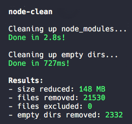
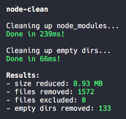
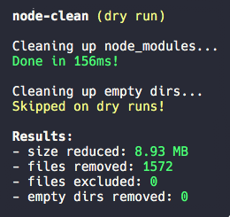

# clean-modules 🧹

> Clean up/prune unnecessary files and reduce the size of your `node_modules` directory. Useful for
> CI caches or for reducing the size of your AWS Lambdas/Azure Functions.

Look, it's yet another `node_modules` cleaning tool! There are lots of these around, but I still
found the need to write my own. See the [Alternatives](#alternatives) section for more details.

This CLI tool combines combines all features that I could not find in other tools:

- 🧹 Removes directories and files that are unnecessary and **safe to remove in production**
- 🛠 Easily customisable through glob patterns
- 📁 Cleans up empty directories after removing files
- ⚡️ Super fast, but still written in Node
- 🔍 Allows analyzing results, like which pattern excluded which file

## Screenshots

<p align="center">
  
  
  
</p>

## Table of contents

<details><summary>Click to open</summary>

- [Installation](#installation)
- [Usage](#usage)
- [Options](#options)
  - [`--include | -i`](#---include----i-)
  - [`--exclude | -e`](#---exclude----e-)
  - [`--analyze | -a`](#---analyze----a-)
  - [`--keep-empty | -k`](#---keep-empty----k-)
  - [`--dry-run | -d`](#---dry-run----d-)
  - [`--yes | -y`](#---yes----y-)
  - [`--json | -j`](#---json----j-)
  - [`--version | -v`](#---version----v-)
  - [`--help | -h`](#---help----h-)
- [Globs](#globs)
  - [Recommended inclusions](#recommended-inclusions)
  - [Recommended exclusions](#recommended-exclusions)
- [Alternatives](#alternatives)
  - [Comparisons](#comparisons)

</details>

## Installation

`clean-modules` can be installed globally if you only want to use it as a CLI tool:

```bash
# npm
npm install -g clean-modules

# yarn
yarn global add clean-modules
```

## Usage

Simply run the command in the directory where your `node_modules` are:

```bash
clean-modules
```

You can also pass a path to where your `node_modules` are located as a positional argument:

```bash
clean-modules path/to/my/node_modules
```

If you want to include/exclude certain globs, skip the confirmation box or try running it without
actually removing any files - check out the [options](#options)!

## Options

### `--include | -i`

`string` (default: `undefined`)

Accepts a glob string of files/folders to include that are not included by default. Can be added
multiple times.

See the [globs](#globs) section for info on how the globs are parsed and which globs are included by
default.

**Example**:

```bash
# includes all TypeScript declaration files and @types folders
clean-modules --include "**/*.d.ts" --include "**/@types/**"
```

### `--exclude | -e`

`string` (default: `undefined`)

Accepts a glob string of files/folders to exclude from the list of included files. Excludes files
included by both `--include` option and by default. Can be added multiple times.

See the [globs](#globs) section for info on how the globs are parsed and which globs are included by
default.

**Example**:

```bash
# excludes all sourcemap files and PNG files
clean-modules --exclude "**/*.map.js" --exclude "**/*.png"
```

### `--analyze | -a`

`analyze` (default: `false`)

Prints info of all globs used, which files were removed or excluded, and which globs they were
included by.

### `--keep-empty | -k`

`boolean` (default: `false`)

Skips removing empty folders after removing files.

### `--dry-run | -d`

`boolean` (default: `false`)

Runs the script and prints the same information, but doesn't actually remove any files.

### `--yes | -y`

`boolean` (default: `false`)

Skips the confirmation prompt at the start of the script.

### `--json | -j`

`boolean` (default: `false`)

Only logs a final JSON dump at the end of the script, useful for logs or services.

### `--version | -v`

Prints the installed version of `clean-modules`.

### `--help | -h`

Prints the help documentation.

## Globs

`clean-modules` uses [`picomatch`](https://github.com/micromatch/picomatch) with the following options
for all glob matching:

```js
{
  dot: true,
  nocase: true
}
```

This means that it will not ignore dotfiles, and does not care about casing of filenames or
directories. Globs are matched with the **full file paths**, not just the file names, so if you just
want to include a specific file make sure to prefix it with globstars (like `**/fileToInclude.js`).

### Recommended inclusions

- `**/*.d.ts`: **If you don't use TypeScript.** TypeScript declaration files take up a lot of space
  in your `node_modules` folder, but they are most likely required to build your application. Useful
  locally even if you don't use TypeScript since they can be parsed by your IDE.

### Recommended exclusions

- `**/*.map.js`: **If you are running `clean-modules` locally or need source files in production.**
  `clean-modules` removes sourcemap files by default since they take up a lot of space and does not
  break builds when removed. They can be nice to have though, especially while developing.

## Alternatives

The most common issues I found with available tools are:

- They only allow inclusion/exclusion of file names, not file paths. This prevents you from e.g.
  excluding subdirectories of a specific folder, like `@types/react-native`.
- They include too many, or too few, patterns by default. Lots of them also include patterns like
  `*.ts` by default, which breaks TypeScript declaration files on build.
- They are too slow (only relevant when running on large projects)
- They are abandoned or don't respond to issues.

### Comparisons

#### clean-modules (this project)

- ✅ Inclusion/exclusion through file path globs
- ✅ Fast
- ✅ Safe list of files and folders included by default (for production use)
- ✅ Cleans up empty directories

#### [yarn autoclean](https://classic.yarnpkg.com/en/docs/cli/autoclean/)

- ✅ Included with Yarn by default
- ✅ Inclusion/exclusion through globs
- ⛔️ Very slow compared to alternatives
- ⛔️ Runs on every install, both locally and in CI
- ⛔️ Small list of files included by default

#### [modclean](https://github.com/ModClean/modclean)

- ✅ Cleans up empty directories
- ✅ Safe list of files and folders included by default
- ⛔️ Slow, only slightly faster than `yarn clean`
- ⛔️ Only allows inclusion/exclusion by file name globs, not file path
- ⛔️ Complains about empty folders that doesn't exist
- ⛔️ Abandoned

#### [node-prune](https://github.com/tj/node-prune)

- ✅ Fastest option available
- ⛔️ Written in Go and might require separate binary download
- ⛔️ Removes some dangerous files by default (like `.d.ts` files and `assets` folder)
- ⛔️ Only allows inclusion/exclusion by file name globs, not file path
- ⛔️ Globs are very limited since it uses Go's `filepath.Match`
- ⛔️ Does not remove empty folders

#### [nm-prune](https://github.com/tuananh/node-prune)

- ✅ Fast
- ⛔️ Removes some dangerous files by default (like `.d.ts` files and `assets` folder)
- ⛔️ Only allows inclusion/exclusion by file name, not file paths or globs
- ⛔️ Does not remove empty folders
- ⛔️ Small list of files included by default
